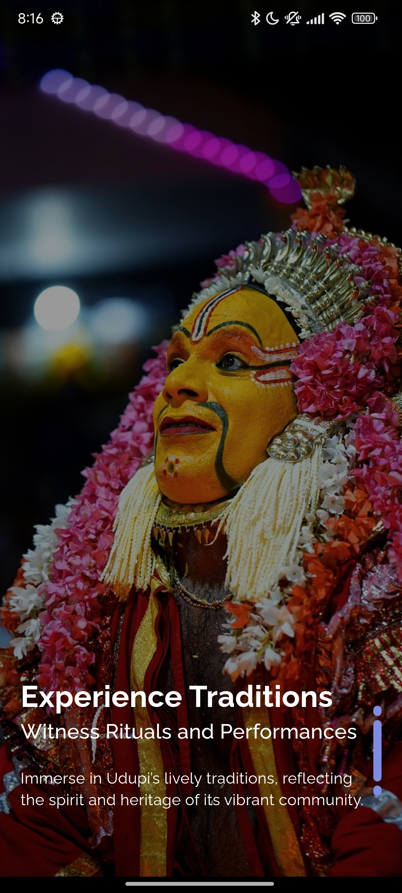
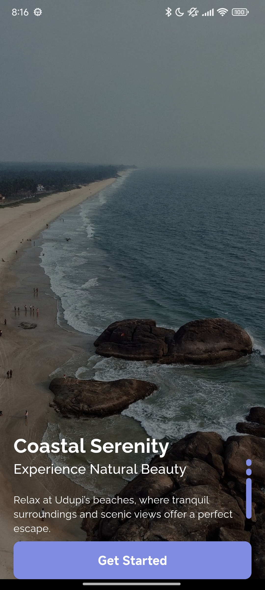
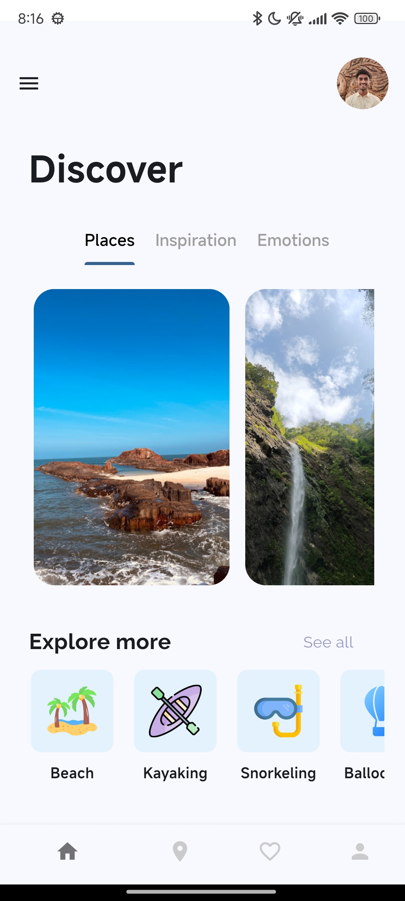
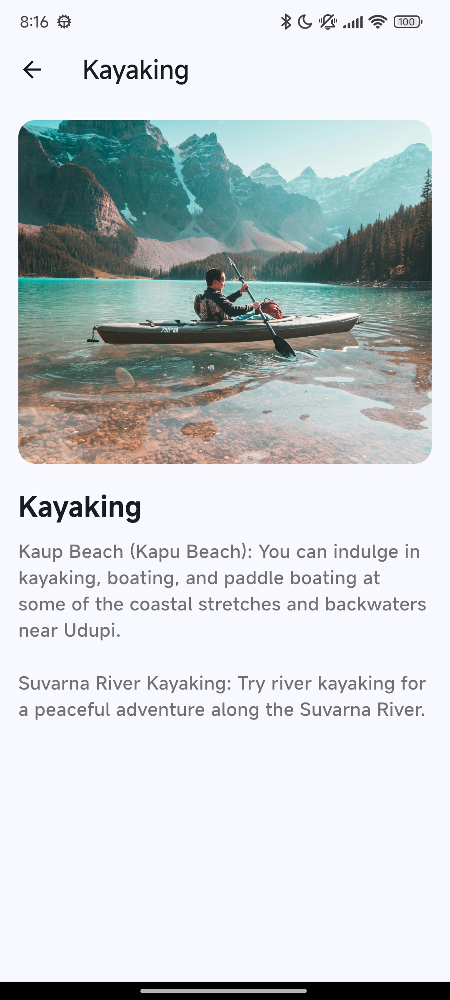
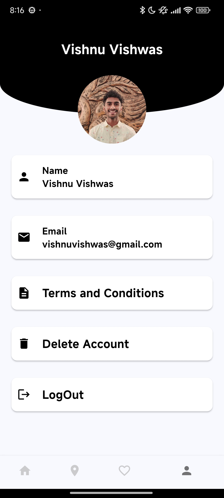
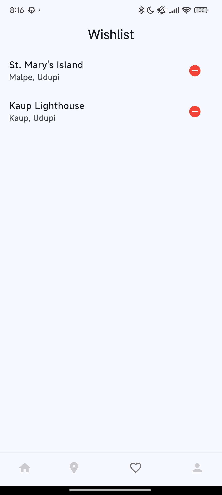
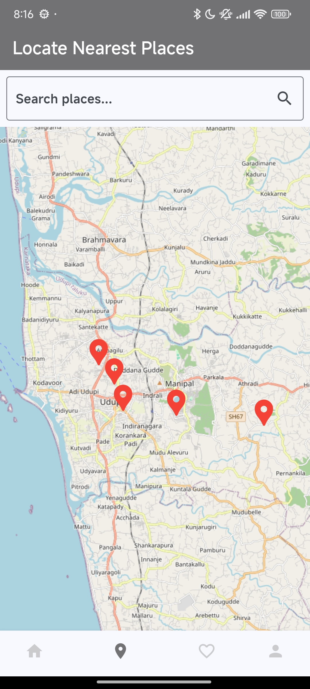

# Udupi Insights - Flutter Frontend

## Overview
The Udupi Insights app offers users a seamless and interactive experience to explore the tourist destinations in Udupi. It is built using **Flutter** for cross-platform mobile development and integrates features like user authentication, wishlist management, and interactive maps.

## Screenshots

  
  
  
  

  
  
  
  

## Key Features

### Explore Destinations 🗺️
- Browse detailed information about tourist spots in Udupi.
- View descriptions, images, and relevant details of each place.

### Interactive Map 📍
- Explore locations using an interactive map integrated with the app.

### Wishlist Management ❤️
- Users can add their favorite tourist places to a personalized wishlist.
- Easily access and manage saved places.

### Reviews and Ratings ⭐
- Users can rate and review the places they visit.
- View reviews and ratings submitted by other users.

### Profile Section 👤
- Manage and update user profile details.

## Technologies Used
- **Flutter**: Framework for building cross-platform mobile applications.
- **GetX**: State management and navigation within the app.
- **REST API**: Integrated with a Flask backend for handling data management and synchronization with the server.

## Images Source
Images used in the app are sourced from Google, Unsplash, Pexels and Instagram.
